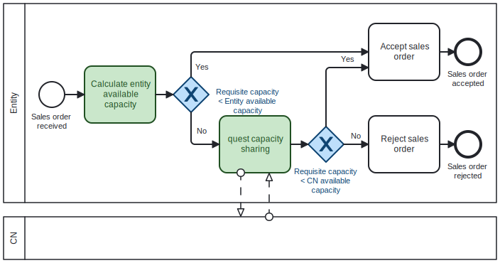
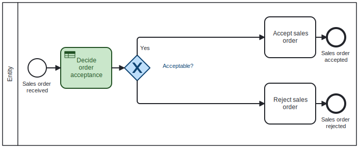
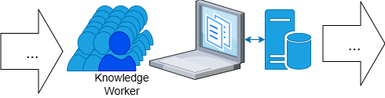
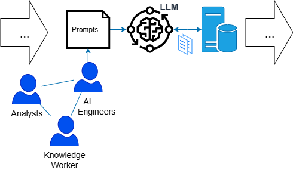
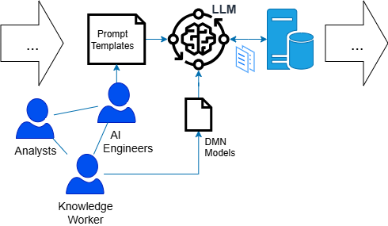

# Evaluating Business Process Feedback using LLM and DMN

This repository presents the implementation and evaluation of a novel **DMN-guided prompting framework** for controlling Large Language Models (LLMs) in automated feedback generation. The work is based on the thesis:

📄 **[DMN-Guided Prompting: A Low-Code Framework for Controlling LLM Behavior](https://arxiv.org/abs/2505.11701)**  
🧑‍🎓 Master’s Thesis, Politecnico di Torino  
👨‍🏫 Supervised by Dr. Amin Jalali, Stockholm University

---
## 🔍 Overview

LLMs like GPT-4 offer powerful capabilities for natural language reasoning, but lack structure, transparency, and maintainability when used with traditional prompt engineering. This project proposes a framework that uses **Decision Model and Notation (DMN)** to modularize and guide LLM behavior, enabling:

- **Structured, rule-based prompting** using DMN elements.
- **Automated feedback generation** for process modeling tasks.
- **Improved precision, interpretability, and scalability** over ad hoc prompts.

This framework suggests separating decision logic from prompts, enabling business users to modify decision rules themselves without requiring an AI engineer. This makes it easier and faster for businesses to adapt AI-automated processes, allowing them to respond to changes quickly—an important factor for staying competitive. The idea of separating decision logic from processes is not new; it originates from process modeling, where separating decision models (e.g., using DMN) from process models (e.g., BPMN) has already shown clear benefits. For those without a background in business process management, we can illustrate this with an example in [1]. Consider the following process model, which encodes how sales orders are rejected or approved.



Separating the logic using DMN encapsulates the decision rules into a single activity (shown with a rounded rectangle), where the decision can be modeled with a notation that business people can easily understand and update. This makes it simpler to adjust the process if the logic changes, while reducing the need to modify the process model itself. The process continues to perform different tasks based on decision outcomes rather than internal rule details.



In AI automation, imagine automating a part of a process where many knowledge workers currently perform an activity (as shown in the figure below), and where an LLM can perform the same task.



Replacing people with an LLM requires AI engineers to collaborate with knowledge workers and analysts to define suitable prompts, which can then be deployed in production. This solution not only reduces operational costs but also enables scaling, as illustrated in the figure below.



If the decision logic is embedded within the prompt, any change requires the same collaboration cycle to refine the prompt. This can cause delays and create unnecessary workload in organizations, especially when changes are frequent. Our framework addresses this by separating business logic from prompts, modeling it in a way that business users can manage themselves, as shown in the figure below.



We propose the concept of prompt templates, which require less frequent changes, while the most common adjustments can be carried out directly by business users. Different organizations can adapt these templates to suit their specific needs, just as people may model rules differently in DMN. This flexibility allows businesses to fine-tune templates to achieve the best possible results. Our approach is demonstrated using a loan approval process scenario with example feedback texts.

---

## 🚀 Key Features

✅ **Separting decisions from prompts**  
* Breaks down decision logic into three components: input fields, decision tables, and literal expressions, modeled using DMN.
* Empowers end users to update decision logic directly, enabling businesses to implement changes in AI-automation use cases more quickly, without depending on AI engineers. 
* Increases transparency by clarifying how decisions are made by LLMs within AI-driven processes.

✅ **Defining Prompt templates**  
* AI engineers only need to develop a general prompt template that allows LLMs to make decisions using the provided DMN files.
* These templates can be tweaked and adapted to improve LLM performance, depending on how DMNs are defined by different organizations, since these definitions may vary across institutions.

✅ **Educational Case Study**  
* Applied in a graduate-level course to evaluate Petri net models and generate feedback.

---
## 📋 Prompt Template

The **Prompt Template** provides a reusable framework for structuring LLM interactions with DMN models. It standardizes how prompts are constructed, ensuring consistent evaluation of decision rules across different scenarios. The template abstracts the complexity of DMN parsing and rule evaluation, making it easier to adapt the framework to new use cases without modifying the core prompt logic.

For implementation details and examples, see the [synthesized_case](src/synthesized_case) folder.

---
## 📁 Repository Structure

The repository is organized as follows:
```
├── README.md                         # Project documentation
├── requirements.txt                  # Python libraries required
├── images/                           # Images and diagrams used in documentation
│   ├── Introduction_Image1.png       # Process automation illustration
│   ├── Introduction_Image2.png       # LLM automation illustration  
│   ├── Introduction_Image3.png       # DMN-guided prompting illustration
│   ├── diagram.svg                   # Process model with embedded decision logic
│   └── diagram2.svg                  # Process model with separated decision logic
└── src/                              # Source code and related files
    ├── running_example/              # Running example implementation
    │   ├── loan_approval.ipynb       # The notebook with the running example prompt template
    │   ├── loan_approval.dmn         # DMN file for decision logic
    │   └── examples/                 # Sample natural language inputs
    │       ├── loan_approval_test1.txt
    │       ├── loan_approval_test2.txt
    │       └── loan_approval_test3.txt
    └── synthesized_case/              # Notebook with prompt template for the case study
        ├── synthesized_case.ipynb     # Template for DMN-guided prompting
        ├── DMN file_task evaluation.dmn # DMN file for task evaluation
        ├── case_study/               # Case study examples and documentation
        │   ├── Exercise_1/
        │   │   ├── Exercise_1.pnml   # PNML file for Exercise 1
        │   │   ├── Exercise_1.txt    # Converted text description
        │   │   └── case_study1.txt   # Evaluation results
        │   └── Exercise_2/
        │       ├── Exercise_2.pnml   # PNML file for Exercise 2
        │       ├── Exercise_2.txt    # Converted text description
        │       └── case_study2.txt   # Evaluation results
        └── utils/                    # Utility scripts and notebooks
            ├── Chain of thought code.ipynb    # Chain of thought implementation
            └── Convert_pnml_to_text.ipynb    # Converts PNML to text descriptions
```
## 🧪 How It Works

1. **User Input**: A process description in plain English (e.g., student assignment).
2. **Decision Logic**: Encoded in a DMN model with rules and feedback messages.
3. **Prompt Framework**:
   - Parses the DMN into triples.
   - Guides the LLM to extract inputs, evaluate rules, and generate responses.
4. **Output**: A decision-specific feedback message.

---

## 🚀 Getting Started

### Requirements

* Python 3.8 or higher
* openai
* Jupyter Lab or Jupyter Notebook
* An API key for the Large Language Model you are using (e.g., OpenAI).

### Installation

```bash
git clone https://github.com/Shaghayegh-Abedi/DMN-prompting-project
cd DMN-prompting-project
pip install -r requirements.txt
```


## 📓 Notebooks and How to Use Them

This project includes three Jupyter notebooks:

- [loan_approval.ipynb](src/running_example/loan_approval.ipynb)  
  → This notebook provides the code and the prompt template demonstrating how the LLM uses the DMN logic to generate feedback. 
  
  🟢 Inputs: plain-text process descriptions (e.g., `loan_approval_test1.txt`)  
  🟢 Logic: decision rules from `loan_approval.dmn`  
  🟢 Output: automated feedback messages

- [synthesized_case.ipynb](src/synthesized_case/synthesized_case.ipynb)  
  → This notebook provides the code and the prompt template used in the case study for DMN-guided evaluation which was used to give feedback to students. It receives two input files (DMN file_task evaluation.dmn and text file) and evaluates the text file based on rules inside the DMN file, publishing messages corresponding to each rule. In addition, we provided synthesized process models similar to what students submitted to recieve feedback. Note that the process is not identical to what we had in the case study due to privacy concerns. 

  🟢 Inputs: DMN file (decision rules) and text file (case description)  
  🟢 Process: Rule-based evaluation using LLM  
  🟢 Output: Rule-specific feedback messages

- [Convert_pnml_to_text.ipynb](src/synthesized_case/utils/Convert_pnml_to_text.ipynb)  
  → This notebook **converts PNML (Petri Net Markup Language) files** into simple textual descriptions to be used as inputs for student-submitted process descriptions.  


### 📚 Case Study Exercises

Due to privacy considerations and the lack of consent to publish student assignments, we have prepared two synthetic exercises that are similar to what was required in student exams. These exercises are located in the `case_study` folder and serve as demonstration examples for the DMN-guided evaluation framework.

Each exercise includes:
- **PNML file**: The original Petri net model in PNML format
- **Converted text file**: The PNML converted to a readable text description
- **Evaluation results**: `case_study1.txt` and `case_study2.txt` contain the results of evaluating the text files based on the rules defined in `DMN file_task evaluation.dmn`


These synthetic cases demonstrate how the framework can be applied to evaluate process modeling assignments while maintaining student privacy. The code for CoT is also provided in [Chain of thought code.ipynb](src/synthesized_case/utils/Chain%20of%20thought%20code.ipynb).

### ▶️ How to Run the Notebooks

1. Launch Jupyter:
   ```bash
   jupyter notebook
   ```
2. Open the desired notebook from the file browser.
3. Run each cell with `Shift + Enter`.

> 💡 Make sure your OpenAI API key is configured before running the feedback generation code.
---
## License

This project is licensed under the MIT License.

## References

[1] Biard, T., Le Mauff, A., Bigand, M., & Bourey, J. P. (2015, October). Separation of decision modeling from business process modeling using new “Decision Model and Notation”(DMN) for automating operational decision-making. In Working Conference on Virtual Enterprises (pp. 489-496). Cham: Springer International Publishing.

## Cite our work

If you use **DMN-Guided Prompting** in your research, please cite our paper:

```
@article{DMN_Guided_Prompting,
      title={DMN-Guided Prompting: A Framework for Controlling LLM Behavior}, 
      author={Shaghayegh Abedi and Amin Jalali},
      year={2025},
      eprint={2505.11701},
      archivePrefix={arXiv},
      primaryClass={cs.AI},
      url={https://arxiv.org/abs/2505.11701}, 
}
```

---
